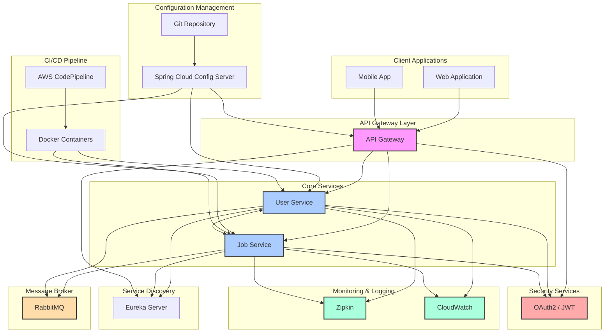

# Job Posting & Search Platform (Microservices)

## Overview
This project is a microservices-based architecture for a job application platform, allowing for enhanced scalability, independent service deployment, and efficient resource utilization.

## Technologies
- **Languages & Frameworks**: Java, Spring Boot 3, Spring Cloud
- **Databases**: PostgreSQL
- **Messaging**: RabbitMQ
- **Containerization & Orchestration**: Docker, AWS ECS
- **CI/CD**: AWS CodePipeline, AWS CloudWatch
- **Testing**: JUnit, Spring Boot Test
- **Monitoring**: Spring Boot Actuator, Zipkin
- **Security**: OAuth2, JWT, Spring Security

## Key Features
- **Microservices Architecture**: Two core services: Job Service and User Service, promoting independent service scalability and resilience.
- **API Gateway**: Implemented a centralized API Gateway for streamlined routing and load balancing.
- **Service Discovery & Communication**: Utilized Eureka Server for service discovery and OpenFeign for inter-service communication.
- **Configuration Management**: Integrated Spring Cloud Config Server for centralized configuration management across microservices.
- **Asynchronous Messaging**: Leveraged RabbitMQ for asynchronous message processing, ensuring loose coupling and efficient job updates.
- **Security**: Implemented stateless authentication using JWT and OAuth2, securing communication between services with Spring Security.
- **CI/CD Pipeline**: Automated containerized deployments with AWS CodePipeline, enabling continuous integration and delivery.
- **Monitoring & Logging**: Integrated distributed tracing with Zipkin and application monitoring with CloudWatch to improve reliability and debug capabilities.

## Microservices Architecture
### Components

1. **Client Layer**:
   * Web Application
   * Mobile Application

2. **API Gateway Layer**:
   * Centralized API Gateway for routing and load balancing

3. **Core Services**:
   * User Service
   * Job Service
   * Inter-service communication using OpenFeign

4. **Service Discovery**:
   * Eureka Server for service registration and discovery

5. **Configuration Management**:
   * Spring Cloud Config Server
   * Git Configuration Repository

6. **Message Broker**:
   * RabbitMQ for asynchronous message processing

7. **Security Layer**:
   * OAuth2 and JWT authentication
   * Spring Security integration

8. **Monitoring & Logging**:
   * Zipkin for distributed tracing
   * CloudWatch for application monitoring

9. **CI/CD Pipeline**:
   * AWS CodePipeline
   * Docker containerized deployment
     
### Diagram

## Getting Started
This guide will help you set up and run the microservices architecture locally, AWS deployment details are excluded.

## Local Development Setup

### Prerequisites
- Java JDK 17 or later
- Maven 3.8.x
- Docker Desktop
- Git
- RabbitMQ (can be run via Docker)
- IDE of your choice (IntelliJ IDEA recommended)

### Steps to Run Locally

1. **Clone the Repository**
   ```bash
   git clone https://github.com/your-repo/microservices-project.git
   cd microservices-project
   ```
2. **Start Infrastructure Services**
   ```bash
   # Start RabbitMQ
   docker run -d --name rabbitmq -p 5672:5672 -p 15672:15672 rabbitmq:3-management

   # Start Zipkin
   docker run -d --name zipkin -p 9411:9411 openzipkin/zipkin

3. **Start Services in Order**
   ```bash
   # 1. Start Config Server
   cd config-server
   mvn spring-boot:run
   
   # 2. Start Eureka Server
   cd ../eureka-server
   mvn spring-boot:run
   
   # 3. Start Core Services
   cd ../user-service
   mvn spring-boot:run
   
   cd ../job-service
   mvn spring-boot:run
   
   # 4. Start API Gateway
   cd ../api-gateway
   mvn spring-boot:run

4. **Verify Setup**
- Eureka Dashboard: http://localhost:8761
- API Gateway: http://localhost:8080
- Zipkin: http://localhost:9411
- RabbitMQ Management: http://localhost:15672
